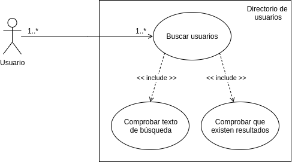

## Definición de caso de uso

### Búsqueda de usuarios:
Se solicita la creación de un buscador de usuarios, que solictando un texto, ha de proporcionar los usuarios
que coincidan pacial o totalmente con sus propiedades.

#### Actor primario
El actor primario está representado por el visitante que realiza la búsqueda.

#### Sistema
Definimos como sistema el directorio de usuarios que contiene todo los usuarios junto a sus propiedades donde se realiza
la búsqueda.

#### Participantes
Como único particimante del caso de uso tenemos al visitante que realiza la busqueda.

#### Codiciones previas
Previamente al uso del buscador tenemos que disponer de un un directorio que contenga usuarios. Si el directorio
se encuentra vacio no es posible realizar ninguna búsqueda.

#### Operaciones
Las operaciones serán las siguientes:

 1. Obtener el texto por el que realizar la búsqueda.
 2. Comprobar que usuarios que coinciden con la búsqueda.
 3. Mostrar los usuarios que coinciden con la búsqueda.

#### Extensiones
Las extensiones por cada una de las operaciones:

 * 1.a Validar el texto de busqueda.
    * 1.a.1 Si no es correcto mostrar un mensaje de error.
    * 1.a.2 Si es correcto proseguir.

 * 3.a ¿Existen resultados para la busqueda?
    * 1.a.1 Si no hay resultado indicar que no exsten coincidencias.
    * 1.a.1 Si existen proseguir.
    
## Diagrama de secuencia

Se busca definir las interacciones entre los diferentes objetos dentro de la apliación